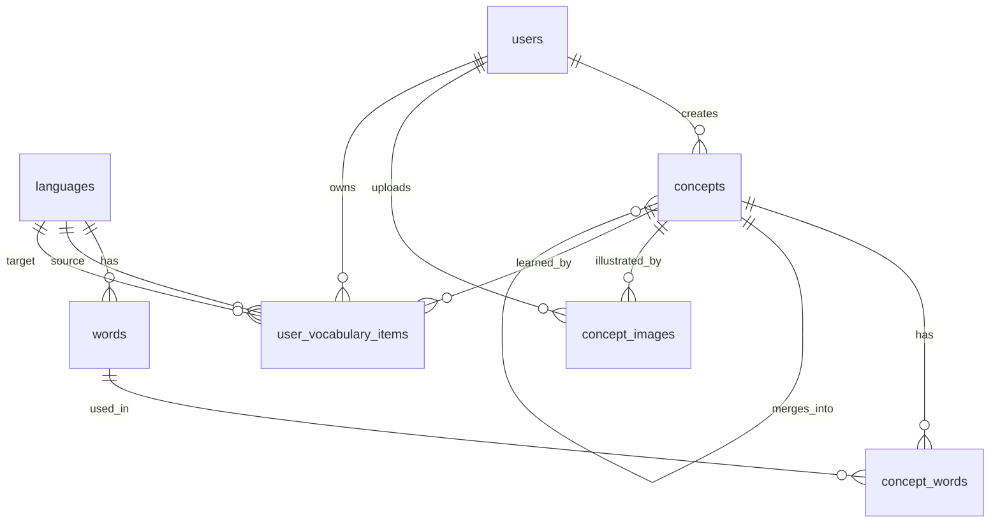

# Vocabulary Database Model

Документ фиксирует текущее состояние модели БД для словарного приложения и целевую структуру, к которой планируем прийти. Это рабочая проектная договоренность: перед реализацией миграций и API модель можно уточнять.

## Цель Фичи

Нужно добавить внутреннее приложение для изучения слов и фраз.

Основная идея:

- пользователь может добавить слово или фразу и сразу начать ее учить;
- слова и фразы могут быть на разных языках;
- значения связываются через `concept`;
- модерация не блокирует личное использование;
- админская верификация нужна только для попадания записи в общий словарь.

## Текущее Состояние

На backend уже есть начальные таблицы и сущности.

### `languages`

Справочник языков.

Текущие поля:

- `id`
- `code`
- `name`
- `created_at`
- `updated_at`

Текущая роль:

- хранит доступные языки;
- уже используется как связь для `words`.

### `words`

Конкретное слово или фраза на конкретном языке.

Текущие поля:

- `id`
- `language_id`
- `text`
- `normalized_text`
- `created_at`
- `updated_at`

Текущие ограничения:

- `UNIQUE(language_id, normalized_text)`

Текущая роль:

- хранит текстовое выражение;
- не хранит смысл само по себе;
- один и тот же текст может участвовать в разных `concept`, если позже потребуется поддержать омонимию.

### `concepts`

Смысловая единица, которая должна связывать выражения на разных языках.

Текущие поля:

- `id`
- `primary_word_id`
- `created_by_user_id`
- `status`: `pending`, `verified`, `rejected`
- `verified_by_user_id`
- `verified_at`
- `created_at`
- `updated_at`

Текущие ограничения модели:

- `concept` сейчас может указывать только на `primary_word_id`;
- нет таблицы, которая связывает один `concept` с несколькими словами или фразами;
- нет личного словаря пользователя;
- нет модели тренировочного набора.

## Целевая Модель: MVP

MVP должен решить три задачи:

1. пользователь добавляет слово или фразу и сразу учит ее;
2. несколько слов или фраз на разных языках связываются через один `concept`;
3. к `concept` можно прикрепить одну или несколько иллюстраций;
4. админы могут верифицировать `concept` для общего словаря.

### `languages`

Оставляем как есть.

### `words`

Оставляем как базовую таблицу выражений.

MVP поля:

- `id`
- `language_id`
- `text`
- `normalized_text`
- `created_at`
- `updated_at`

MVP ограничения:

- `UNIQUE(language_id, normalized_text)`
- index `language_id`

На уровне приложения слово или фраза должны создаваться через upsert:

- нормализуем `text`;
- ищем существующий `word` по `language_id + normalized_text`;
- если нашли, переиспользуем;
- если не нашли, создаем новый.

### `concepts`

Расширяем enum статусов.

MVP поля:

- `id`
- `primary_word_id`
- `created_by_user_id`
- `status`
- `verified_by_user_id`
- `verified_at`
- `rejection_reason`
- `merged_into_concept_id`
- `created_at`
- `updated_at`

MVP `ConceptStatus`:

- `private` - личный concept, создан пользователем и не отправленный в общий словарь;
- `pending` - concept отправлен на модерацию;
- `verified` - concept проверен админом и доступен всем;
- `rejected` - concept отклонен для общего словаря, но остается доступен автору и его личному словарю;
- `merged` - concept признан дубликатом и слит в другой canonical concept.

Правило:

`status` не отвечает за возможность учить слово лично. Он отвечает только за состояние публикации в общем словаре.

Если `concept.status = 'merged'`, поле `merged_into_concept_id` должно указывать на canonical concept, в который перенесены смысл и пользовательские тренировочные записи.

### `concept_words`

Новая таблица. Главная связующая модель между смыслом и выражениями.

MVP поля:

- `id`
- `concept_id`
- `word_id`
- `is_primary`
- `created_by_user_id`
- `created_at`
- `updated_at`

MVP ограничения:

- `UNIQUE(concept_id, word_id)`
- index `concept_id`
- index `word_id`
- index `created_by_user_id`

Роль:

- один `concept` может иметь несколько `word`;
- один `word` потенциально может участвовать в нескольких `concept`;
- `is_primary` помогает выбрать главное отображаемое выражение.

На MVP не добавляем отдельный статус для `concept_words`. Если понадобится модерировать отдельные переводы внутри уже проверенного `concept`, добавим позже.

### `concept_images`

Новая таблица. Хранит изображения, связанные со смыслом, а не с конкретным словом на языке.

MVP поля:

- `id`
- `concept_id`
- `image_url`
- `source_url`
- `alt_text`
- `is_primary`
- `created_by_user_id`
- `status`
- `created_at`
- `updated_at`

MVP `ConceptImageStatus`:

- `private` - изображение доступно автору и может использоваться в его личной тренировке;
- `pending` - изображение отправлено на модерацию;
- `verified` - изображение проверено и доступно в общем словаре;
- `rejected` - изображение отклонено для общего словаря, но может остаться доступным автору.

MVP ограничения:

- index `concept_id`
- index `created_by_user_id`
- index `status`
- index `is_primary`

Роль:

- позволяет хранить несколько изображений для одного `concept`;
- позволяет выбрать главное изображение через `is_primary`;
- не привязывает изображение к одному конкретному языку;
- позволяет модерировать изображения отдельно от самого `concept`.

На уровне приложения нужно следить, чтобы у одного `concept` было не больше одного primary-изображения в рамках нужной области видимости. На уровне БД это можно усилить позже отдельным ограничением, если потребуется.

### `user_vocabulary_items`

Новая таблица. Минимальная личная коллекция слов пользователя.

MVP поля:

- `id`
- `user_id`
- `concept_id`
- `source_language_id`
- `target_language_id`
- `status`
- `created_at`
- `updated_at`

MVP `UserVocabularyItemStatus`:

- `active` - участвует в тренировках;
- `archived` - скрыто из тренировок, но сохранено в личном словаре.

MVP ограничения:

- `UNIQUE(user_id, concept_id, source_language_id, target_language_id)`
- index `user_id`
- index `concept_id`
- index `source_language_id`
- index `target_language_id`
- index `status`

Роль:

- фиксирует, что конкретный пользователь учит конкретный `concept`;
- позволяет ограничить тренировку языковой парой;
- не хранит метрики прогресса в MVP.

Примеры языковых направлений:

- `ru -> en`
- `en -> ru`
- `ru -> hu`
- `hu -> en`

## Правила Доступа

### Личный словарь

Пользователь видит и тренирует все свои `user_vocabulary_items`, независимо от статуса `concept`.

Логика:

```sql
user_vocabulary_items.user_id = currentUserId
AND user_vocabulary_items.status = 'active'
```

Фильтр по языкам:

```sql
source_language_id = :sourceLanguageId
AND target_language_id = :targetLanguageId
```

Изображения для личной тренировки можно показывать, если:

```sql
concept_images.status = 'verified'
OR concept_images.created_by_user_id = currentUserId
```

### Общий поиск

Пользователь видит:

- все `verified` concepts;
- свои собственные concepts, даже если они `private`, `pending` или `rejected`.

Логика:

```sql
concepts.status = 'verified'
OR concepts.created_by_user_id = currentUserId
```

Concepts со статусом `merged` не должны показываться как самостоятельные результаты общего поиска. Если такой concept все еще встречается по прямой ссылке, backend должен вернуть canonical concept из `merged_into_concept_id` или явно показать redirect-like состояние.

Для изображений в общем поиске применяется такое же правило:

```sql
concept_images.status = 'verified'
OR concept_images.created_by_user_id = currentUserId
```

### Модерация

Админская очередь показывает concepts со статусом:

```sql
concepts.status = 'pending'
```

Админ может:

- перевести `pending` в `verified`;
- перевести `pending` в `rejected`;
- заполнить `verified_by_user_id`;
- заполнить `verified_at`;
- при отклонении заполнить `rejection_reason`;
- перевести дубликат в `merged` и заполнить `merged_into_concept_id`.

Отдельная очередь изображений показывает `concept_images` со статусом:

```sql
concept_images.status = 'pending'
```

Админ может:

- перевести изображение в `verified`;
- перевести изображение в `rejected`;
- при необходимости выбрать или заменить primary-изображение для `concept`.

## Типовой MVP-Сценарий

### Пользователь Добавляет Новое Слово

1. Пользователь выбирает `source_language` и `target_language`.
2. Вводит известное выражение, например `кошка`.
3. Вводит изучаемое выражение, например `cat`.
4. Backend upsert-ит оба `word`.
5. Backend создает `concept` со статусом `private` или `pending`, в зависимости от действия пользователя.
6. Backend создает связи в `concept_words`.
7. Если пользователь добавил изображение, backend создает запись в `concept_images`.
8. Backend создает `user_vocabulary_items`.
9. Пользователь сразу видит запись в личном словаре и может тренироваться.

### Пользователь Отправляет Concept На Модерацию

1. Пользователь нажимает действие "submit for review".
2. `concept.status` меняется с `private` на `pending`.
3. Личная тренировка пользователя не меняется.

### Админ Верифицирует Concept

1. Админ видит `pending` concepts.
2. Проверяет связанные `concept_words`.
3. Меняет `concept.status` на `verified`.
4. Проверяет связанные `concept_images`, если они были отправлены на модерацию.
5. Concept появляется в общем поиске для всех пользователей.

## Concept Merge Workflow

This section describes the intended admin behavior when several users create the same meaning separately.

### Core Rule

`Word` stores only a written expression in one language. It does not represent meaning.

Different meanings must be represented by different `concepts`, even if they reuse the same `word`.

Example:

- `cool` as "low temperature" is one concept;
- `cool` as "great / stylish / impressive" is another concept;
- both concepts may point to the same English `word`.

### Duplicate Concepts

If several users create different private or pending concepts for the same meaning, admin should choose or create one canonical `verified` concept.

Other concepts with the same meaning should not be marked as `rejected`, because they are not necessarily wrong. They should be marked as:

```text
status = merged
merged_into_concept_id = canonicalConceptId
```

### User Vocabulary During Merge

When concept A is merged into canonical concept B:

1. useful `concept_words` from A may be copied to B if they are valid and not already linked;
2. useful `concept_images` from A may be copied or re-linked to B if they are valid;
3. `user_vocabulary_items` pointing to A should be moved to B;
4. A should remain in the database with `status = merged`;
5. A should not appear as an independent result in shared search.

This preserves user progress and avoids treating valid duplicates as rejected content.

### Example

Four users add similar entries:

```text
User 1: cool -> клевый
User 2: cool -> классный
User 3: cool -> кул
User 4: cool -> клевый
```

Admin verifies the second user's meaning as the canonical concept:

```text
cool = классный / клевый / круто
```

Expected result:

- User 1 concept is merged into the verified concept;
- User 4 concept is merged into the verified concept;
- `клевый` is added to the verified concept if accepted as a valid synonym;
- User 3 concept is either merged if `кул` is accepted as valid colloquial usage, or rejected if it is considered an incorrect translation;
- all affected `user_vocabulary_items` should point to the canonical verified concept after merge.

Admin must make the final decision. The system may suggest duplicates, but it should not automatically merge concepts solely because their words look similar.

## Дальнейшее Развитие

Эти части намеренно не входят в MVP, но модель должна позволять добавить их без полной переделки.

### Метрики Изучения

Позже можно расширить `user_vocabulary_items`:

- `last_reviewed_at`
- `next_review_at`
- `correct_count`
- `wrong_count`
- `repetition_count`
- `lapse_count`
- `ease_factor`
- `interval_days`

### История Повторений

Можно добавить `vocabulary_reviews`.

Поля:

- `id`
- `user_vocabulary_item_id`
- `direction`
- `answer_text`
- `is_correct`
- `quality`
- `reviewed_at`
- `response_time_ms`

Роль:

- хранить историю тренировок;
- считать статистику;
- строить интервальные повторения.

### Примеры Использования

Можно добавить `concept_examples`.

Поля:

- `id`
- `concept_id`
- `language_id`
- `text`
- `translation_text`
- `created_by_user_id`
- `status`
- `created_at`
- `updated_at`

### Подробности Слова

Можно расширить `words`:

- `type`: `word`, `phrase`, `idiom`, `sentence`
- `part_of_speech`
- `transcription`
- `audio_url`

### Модерация Отдельных Связей

Если общий `concept` уже `verified`, но пользователь предлагает новый перевод, можно расширить `concept_words`:

- `status`
- `verified_by_user_id`
- `verified_at`
- `rejection_reason`

Тогда модерация сможет проверять не только весь `concept`, но и отдельные переводы.

### Улучшение Merge-Механики

Позже можно добавить отдельную историю merge-операций:

- `id`
- `source_concept_id`
- `target_concept_id`
- `merged_by_user_id`
- `merge_reason`
- `created_at`

Это позволит хранить audit trail и объяснять, почему пользовательская запись была перенесена на другой canonical concept.

### Расширение Изображений

Позже можно расширить `concept_images`:

- `storage_key`
- `mime_type`
- `width`
- `height`
- `file_size`
- `license`
- `moderation_note`
- `verified_by_user_id`
- `verified_at`
- `rejection_reason`

Если изображения будут загружаться пользователями, а не только ссылаться по URL, `image_url` может стать публичным URL, а `storage_key` будет внутренним путем в хранилище.

### User Vocabulary Lists

Later users should be able to create named personal vocabulary lists and organize their learning items manually.

This is intentionally outside the MVP. The current MVP keeps one flat personal collection in `user_vocabulary_items`.

Future tables:

#### `vocabulary_lists`

User-owned named list.

Fields:

- `id`
- `user_id`
- `name`
- `description`
- `status`: `active`, `archived`
- `created_at`
- `updated_at`

Constraints:

- index `user_id`
- optional `UNIQUE(user_id, name)` if we decide that one user cannot have two lists with the same name

#### `vocabulary_list_items`

Many-to-many relation between a user list and a personal vocabulary item.

Fields:

- `id`
- `vocabulary_list_id`
- `user_vocabulary_item_id`
- `position`
- `created_at`
- `updated_at`

Constraints:

- `UNIQUE(vocabulary_list_id, user_vocabulary_item_id)`
- index `vocabulary_list_id`
- index `user_vocabulary_item_id`
- optional index `(vocabulary_list_id, position)` for manual ordering

Rules:

- A list belongs to exactly one user.
- A `user_vocabulary_item` may belong to zero, one, or many user lists.
- Adding a verified concept from the shared dictionary should first create or reuse the user's `user_vocabulary_item`, then attach that item to the selected list.
- Dragging an item from another list should create a `vocabulary_list_items` row for the target list.
- By default, drag/drop should behave as "add to this list" and keep the item in the source list. A later explicit "move" action may remove the item from the source list.
- During practice, the user should be able to add the currently studied item to any of their lists, including a list different from the current training source.
- Lists should not affect concept moderation. They are only a personal organization layer.
- Lists should not duplicate learning progress. Progress remains attached to `user_vocabulary_items`, so the same item keeps its review state across all lists.

Possible API later:

- `POST /api/vocabulary/my-lists`
- `GET /api/vocabulary/my-lists`
- `PATCH /api/vocabulary/my-lists/:id`
- `POST /api/vocabulary/my-lists/:id/items`
- `DELETE /api/vocabulary/my-lists/:id/items/:userVocabularyItemId`
- `PATCH /api/vocabulary/my-lists/:id/items/reorder`

## Предварительная ER-Модель MVP



## Открытые Решения

Перед реализацией нужно отдельно согласовать:

- создавать ли новый `concept` по умолчанию как `private` или сразу как `pending`;
- нужен ли пользователю явный action "submit for review";
- можно ли одному пользователю редактировать уже `verified` concept или только предлагать новую версию;
- как обрабатывать омонимы, когда одинаковое слово на одном языке имеет разные смыслы;
- нужен ли `primary_word` один на весь `concept` или отдельный primary word на каждый язык;
- добавлять ли изображения сразу как `private` или отправлять их на модерацию вместе с `concept`;
- хранить ли изображения только как внешние URL или позже добавить загрузку файлов в собственное хранилище;
- нужно ли хранить отдельную историю merge-операций или достаточно `concepts.status = 'merged'` и `merged_into_concept_id`.
